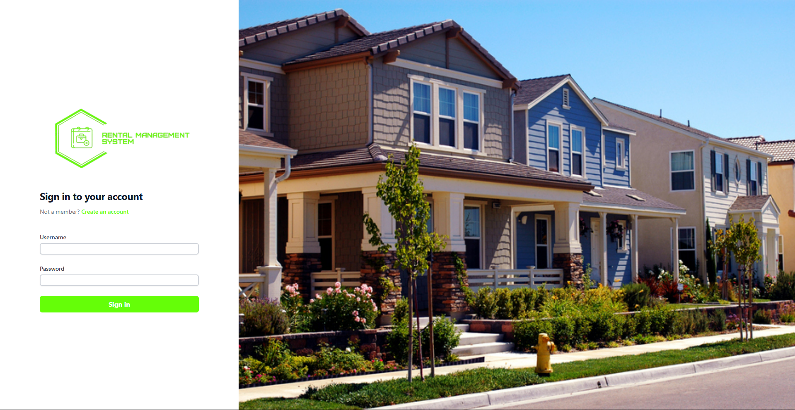
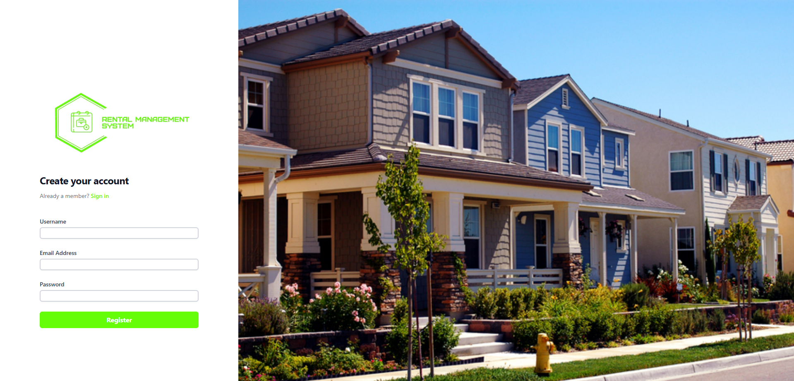
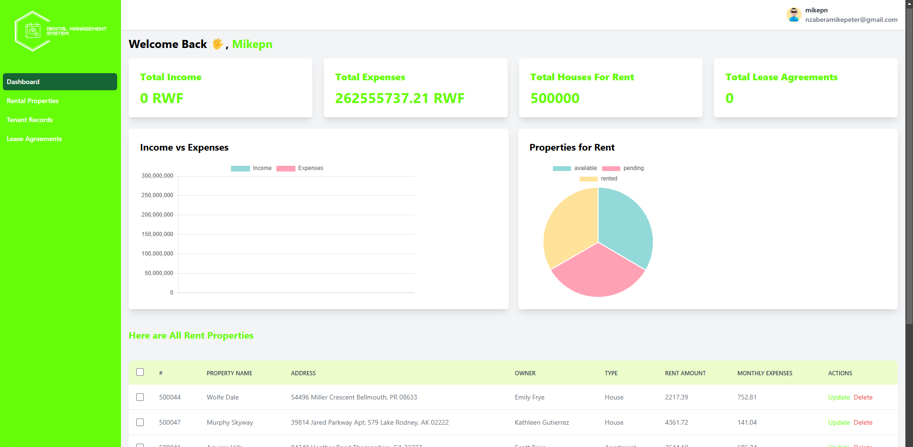
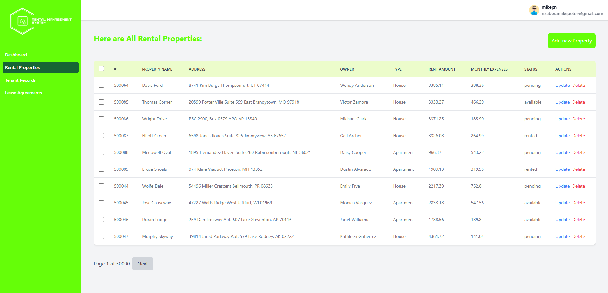
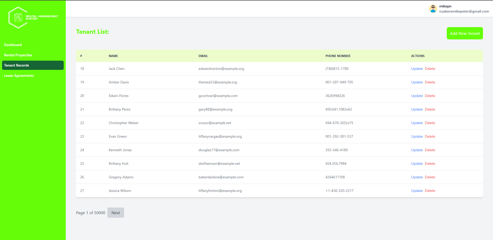

# Rental Management System

## Table of Contents

- [Overview](#overview)
- [Features](#features)
- [Technologies Used](#technologies-used)
    - [Backend (book-social-network)](#)
    - [Frontend (book-social-network-ui)](#frontend-book-social-network-ui)
- [Learning Objectives](#learning-objectives)
- [License](#license)
- [Getting Started](#getting-started)
- [Contributors](#contributors)
- [Acknowledgments](#acknowledgments)

## Overview

The Rental Management System is a full-stack application designed to streamline property and lease management for landlords, property managers, and tenants. It enables users to manage properties, track rental properties, create and maintain lease agreements, and monitor payments. The system includes features such as secure user authentication, property listing management, tenant registration, lease agreement tracking, and payment processing. Built with robust backend and frontend technologies, it ensures scalability, security, and ease of use.

## Features

- User Authentication: Secure login and registration for landlords, tenants, and property managers.
- Property Management: Create, update, and manage property listings.
- Rental Property Tracking: Track which properties are available for rent and those currently leased.
- Lease Agreement Management: Create, update, and track lease agreements, including start and end dates, and terms.
- Tenant Management: Register and manage tenant profiles.
- Notification System: Notify tenants about payment deadlines and lease expirations.
- Secure API: All endpoints are secured using JWT tokens to ensure data protection.


#### Security



#### Dashboard Overview


#### Properties Overview



#### Tenants


## Technologies Used

### Backend (RMS)

- Django


### Frontend

- DJango Template


### Install dependecies

```bash
pip install -r requirements.txt
```

### RUN APPLICATION

```bash
  python manage.py runserver
```

## License

This project is licensed under the Apache License 2.0. See the [LICENSE](LICENSE) file for details.

